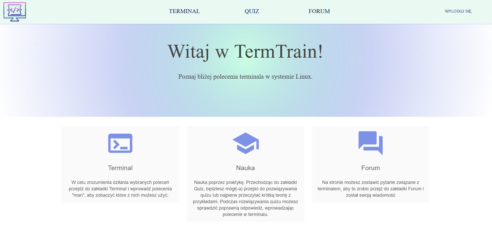
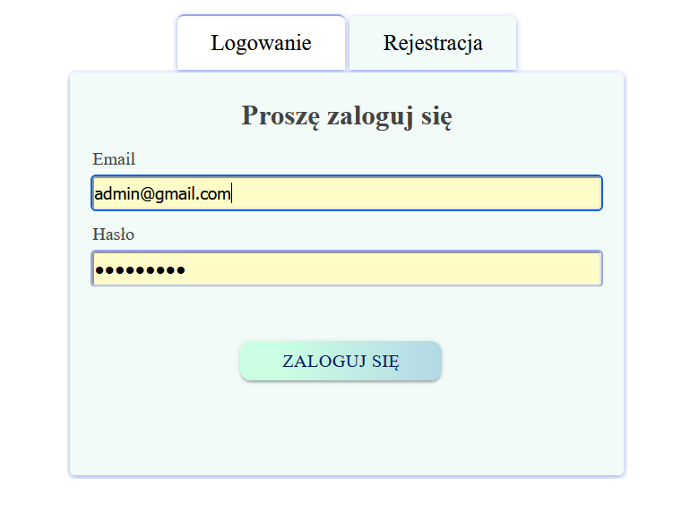
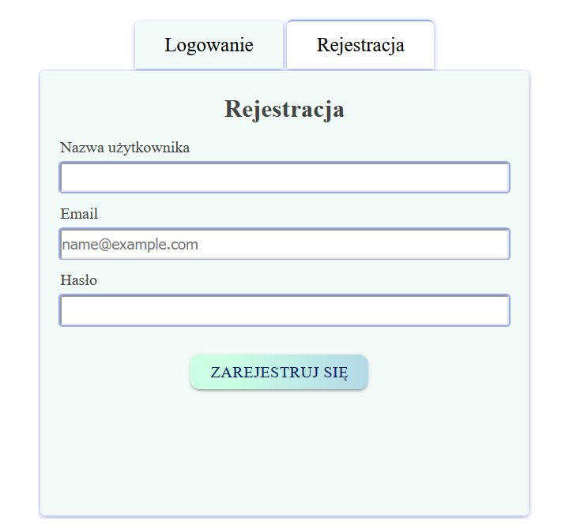
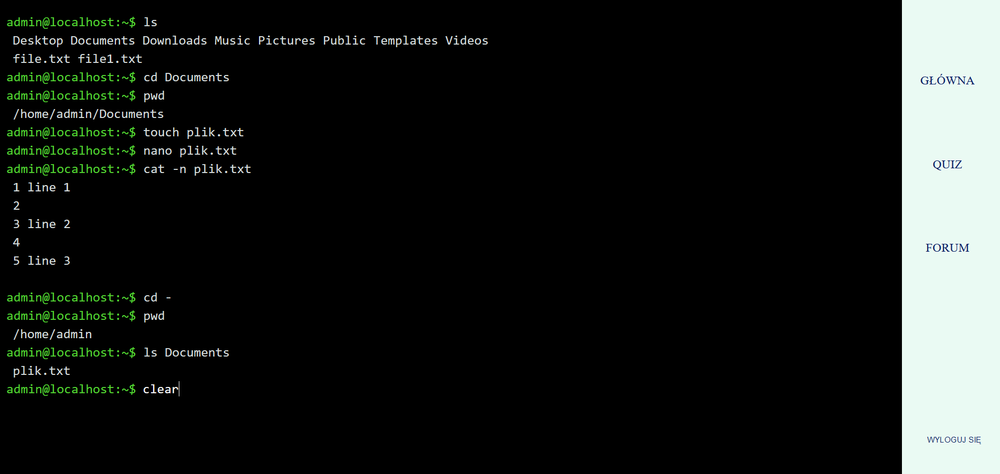
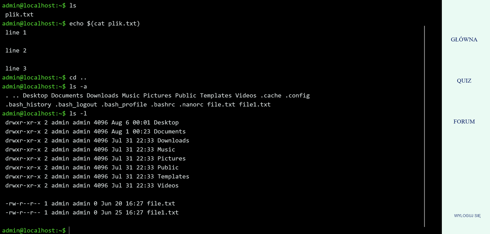
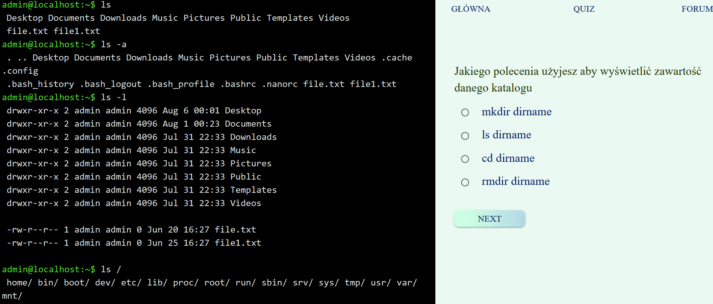
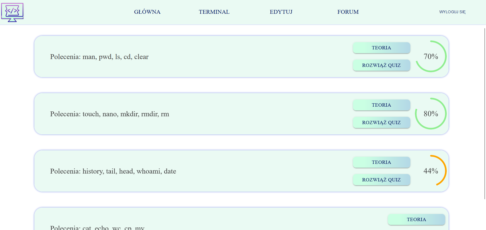
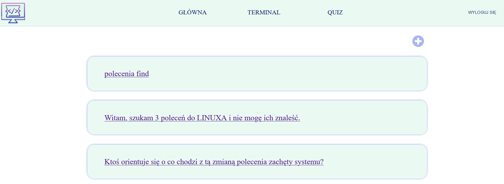

# github-markdown-css

> The minimal amount of CSS to replicate the GitHub Markdown style

[](http://sindresorhus.com/github-markdown-css)

## [Demo](https://sindresorhus.com/github-markdown-css)

## Install

Download [manually](https://raw.githubusercontent.com/sindresorhus/github-markdown-css/gh-pages/github-markdown.css), from [CDNJS](https://cdnjs.com/libraries/github-markdown-css), or with npm:

```
$ npm install github-markdown-css
```

## Usage

Import the `github-markdown.css` file and add a `markdown-body` class to the container of your rendered Markdown and set a width for it. GitHub uses `980px` width and `45px` padding, and `15px` padding for mobile.

```html
<meta name="viewport" content="width=device-width, initial-scale=1">
<link rel="stylesheet" href="github-markdown.css">
<style>
	.markdown-body {
		box-sizing: border-box;
		min-width: 200px;
		max-width: 980px;
		margin: 0 auto;
		padding: 45px;
	}

	@media (max-width: 767px) {
		.markdown-body {
			padding: 15px;
		}
	}
</style>
<article class="markdown-body">
	<h1>Unicorns</h1>
	<p>All the things</p>
</article>
```

If you want code syntax highlighted, use GitHub Flavored Markdown rendered from [GitHub's `/markdown` API](https://developer.github.com/v3/markdown/).

## How

See [`generate-github-markdown-css`](https://github.com/sindresorhus/generate-github-markdown-css) for how it's generated and ability to generate your own.

## Dev

Run `npm run make` to update the CSS.


<body>
        
<h1>TermTrain</h1>  
TermTrain is a web application designed and written for my BA thesis.

<h1>General info</h1>
The main goal of the work was to create a didactic application imitating the behavior of the command line. This app will help new users learn how to use Linux terminal commands.

<h2>Features:</h2>
<ul>
  <li>
    A web application that allows you to use the bash terminal in a web browser without having to install Linux or control it on a virtual machine.
  </li>
  <li>
  The web application allows you to learn bash terminal commands through hands-on exercises.
  </li>
  <li>
   Aplikacja zawiera podstawowe polecenia terminala systemu Linux, takie jak: ls, cd, cp, mv, cat, rm, mkdir, rmdir, touch, nano, man. 
  </li>
  <li>
   Users will be able to consolidate their knowledge by taking a quiz.
    </li>
      <li>
  Before starting the quiz, the user will be able to read this short description of the commands.
      </li>
  <li>
While taking the quiz, users will be able to test their own
answer by typing the appropriate commands in the terminal.
  </li>
</ul>
<h2>TODOs:</h2>
<ul>
  <li>
An additional functionality of the application will be the possibility for users to leave questions related to the Linux system or the bash terminal. Users will
they could also leave their comments under selected questions.
  </li>
</ul>

<h2>Technology<h2>
    <p style="font-size:10px">Backend</p>
    <ul>
     <li>Java: 17</li>
    <li>Spring Boot</li>
    <li>JPA</li>
    <li>Hibernate</li>
    </ul>
    <p>Frontend</p>
     <ul>
     <li>JavaScript</li>
    <li>React</li>
    <li>Docker</li>
    </ul>
    <p>Database</p>
     <ul>
     <li>H2</li>
    </ul>
  <h2>Running the application locally</h2>

<div>
   

  </div>
  





</body>


  


